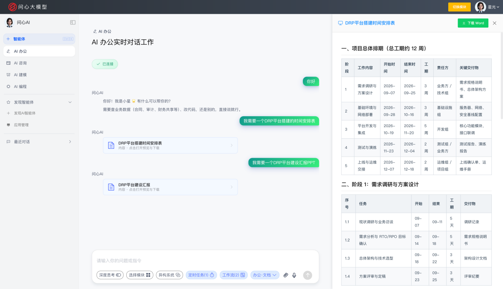
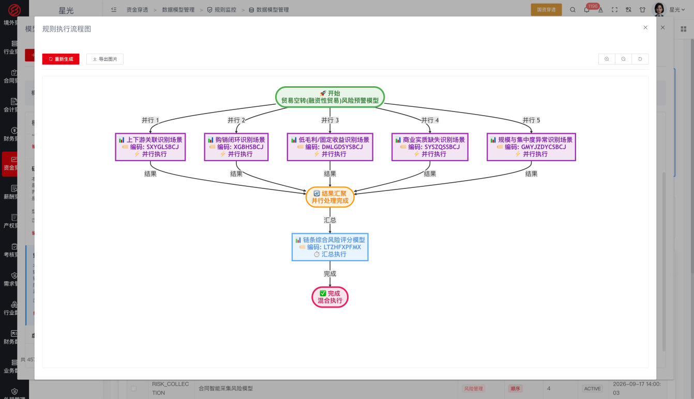
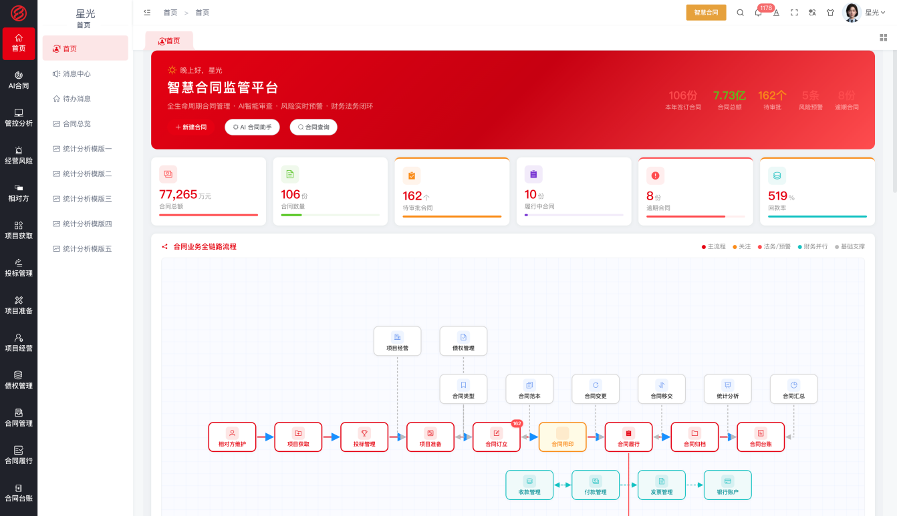
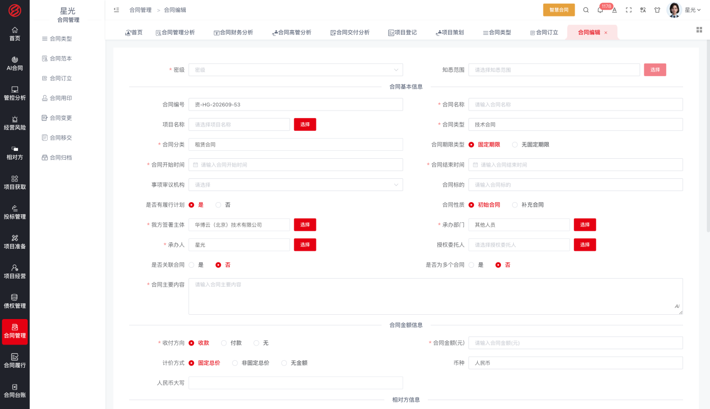
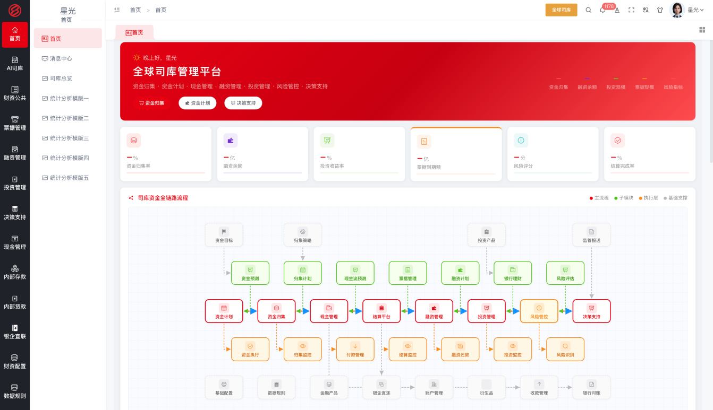
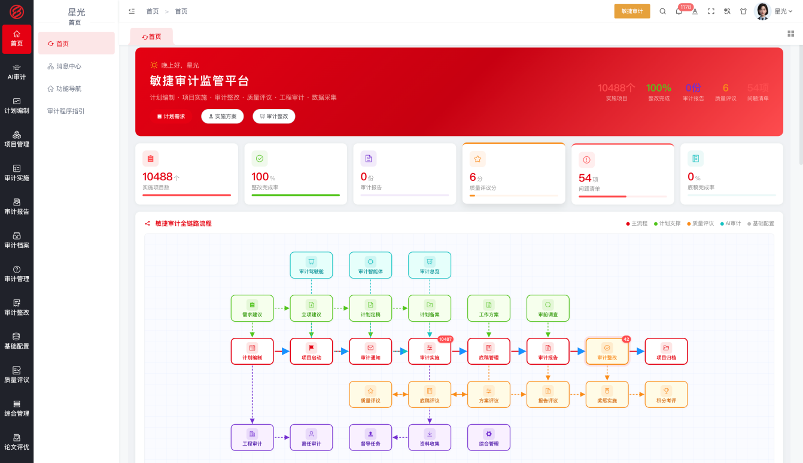
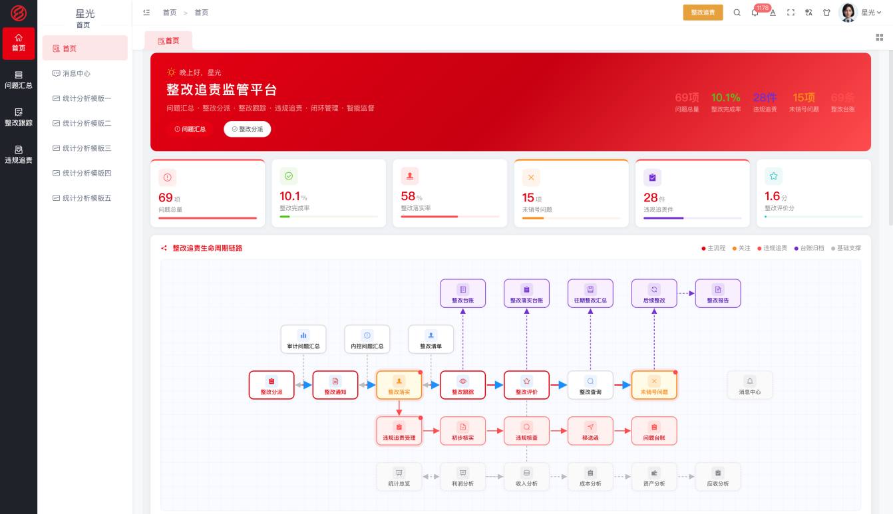
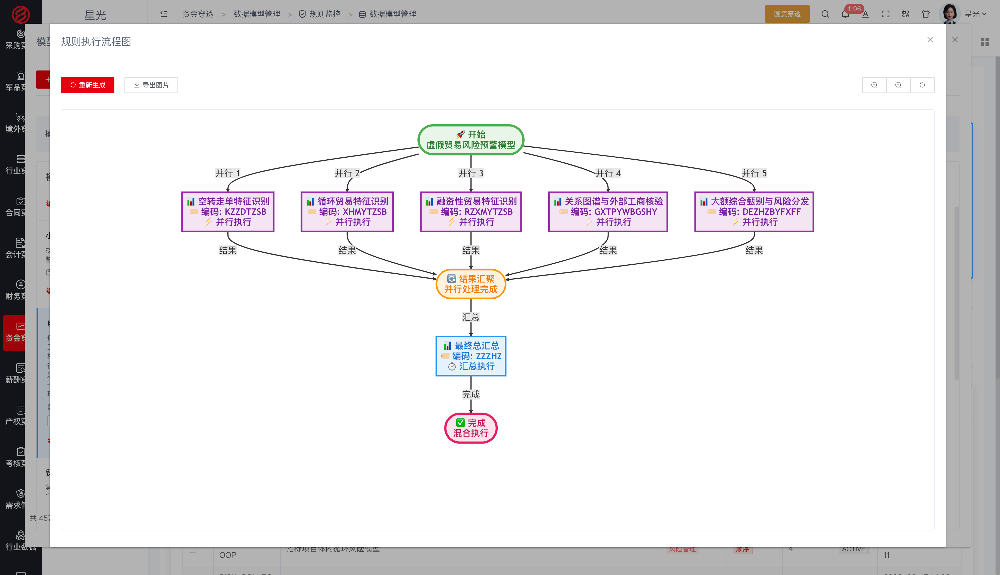

> 🌐 [English](../README.md) | 简体中文

# 问心大模型 · 财经垂直领域大模型

> 让 AI 有能力，直接解决企业问题 ｜ 软件层全部开源，永久免费

   

## 平台简介

问心大模型是由华博云（北京）技术有限公司联合哈尔滨工业大学技术团队研发的财经垂直领域大模型，聚焦财经大脑，深度融合财经领域知识与推理决策能力，让 AI 有能力直接解决企业问题。

平台提供三种工作方式与五大引擎；问心大模型的财经能力形成四大智能。模型与五大引擎共同构成企业 AI 本体，进而生长出覆盖财经全链条的十项应用。应用基于 AI 能力构建，可随业务快速迭代和调整。

**三种工作方式**

- **菜单式** —— 通过功能菜单使用应用，开箱即用
- **技能式** —— 将大模型能力封装为可组合的技能，按场景编排调用
- **对话式** —— 与大模型对话直达业务操作，AI 直接解决问题

**四大智能**

- **AI 办公** —— 大模型的对话工作能力，让日常办公事务自然语言化
- **AI 咨询** —— 大模型的管理咨询能力，财经专家知识沉淀为智能问答
- **AI 建模** —— 大模型的动态建模能力，指标、规则、风险模型随业务动态构建
- **AI 编程** —— 大模型的应用生成能力，动态建模、实时编程、随时交付

四大智能运行于企业 AI 本体之上，作用于企业的业务对象与规则，形成从模型能力到业务执行的价值闭环。

| **AI 办公** | **AI 咨询** | **AI 建模** | **AI 编程** |
|---|---|---|---|
|   |   |    |   |

**问心智能体**

问心智能体是承载四大智能、执行业务的运行单元：在智能体平台上把模型能力、知识库、工具与业务流程编排在一起，作用于企业 AI 本体，下发到业务模块中使用，覆盖从搭建到使用的全流程。

- **搭建** —— 在智能体平台创建应用（对话型或工作流型），可视化编排工作流节点（大模型调用、知识检索、条件分支、模板转换、代码执行、工具调用等），编写提示词、配置模型参数；挂载知识库（上传企业制度与业务文档构建检索增强）与工具插件，让智能体具备企业知识与业务能力
- **调试与发布** —— 通过会话调试验证效果，确认后发布应用并自动获得 API 密钥；支持草稿调试与发布版运行双轨
- **授权下发** —— 在系统设置的智能体管理中，将智能体下发授权到业务模块与成员，控制谁在哪里可以使用
- **使用** —— 业务人员在业务模块内通过 AI 助手调用智能体，以对话交互提出业务诉求，智能体理解后执行相应的业务操作；同时支持以对话方式直达业务
- **运行留痕** —— 对话历史与运行记录留存可查，支撑智能体持续优化

|  |  |

**五大引擎**

组织引擎 · 角色引擎 · 流程引擎 · 表单引擎 · 规则引擎 —— 大模型融入企业运行的运行底座。

**企业 AI 本体**

企业 AI 本体是企业的数字孪生与运营层：将企业的组织架构、业务对象、关联关系与管控规则建模为标准化的知识体系。其根基由三部分构成——企业专属的开发模板约束 AI 的行为规范，MCP 工具接入企业知识与规范，技能授权划定能力边界与执行审批。问心大模型运行于本体之上，成为懂本企业架构、规范与业务的 AI，在企业内持续运行、学习与执行业务。

**平台架构**

问心大模型自上而下分为四层：大模型底座、五大引擎、企业 AI 本体、四大智能的应用。大模型底座提供财经领域的理解、推理与决策能力；组织、角色、流程、表单、规则五大引擎将企业运行要素建模为标准化的知识体系；二者共同构成企业 AI 本体——企业的数字孪生与运营层，沉淀业务对象、关联关系与管控规则。四大智能运行于本体之上，生长出覆盖企业监管与经营全业务链条的应用。

## 十项财经应用

以下应用均基于问心大模型平台搭建，是四大智能在财经业务场景中的落地形态，覆盖企业监管与经营全业务链条；各应用可单独使用，也可一体化运行。

| # | 应用 | 一句话简介 |
|---|---|---|
| 1 | 国资穿透 | 十三大穿透式监管维度，从集团总部到末端企业的全层级穿透，掌握真实经营状况 |
| 2 | 风险管控 | 风险识别、评估、监控、预警、处置全生命周期管理，智能风控驾驶舱实时掌握风险态势 |
| 3 | 内控合规 | 内控矩阵管理、合规规则库、合规性检查与流程执行监控，确保经营符合法规要求 |
| 4 | 智慧合同 | 合同全生命周期管理，AI 智能审查与法律风险识别，降低合同履约风险 |
| 5 | 财务共享 | 总账、应收、应付、固定资产、费用报销集中处理，提升财务运营效率 |
| 6 | 管理会计 | 成本中心、产品成本、内部结算、多维成本分析与控制，支撑管理决策 |
| 7 | 全球司库 | 现金管理、账户管理、资金规划、投融资管理、票据管理、衍生品管理 |
| 8 | 智慧法务 | AI 智能处理法律文件审核、合规检查、案例检索及法律分析建议 |
| 9 | 敏捷审计 | 审计计划、疑点发现、问题整改的全流程管理与 AI 辅助工具提升效率 |
| 10 | 整改追责 | 问题发现后的整改跟踪、责任追溯、闭环管理与成效评估 |

### 应用界面预览

| 应用 | 界面 |
|---|---|
| **1. 国资穿透** |   |
| **2. 风险管控** |   |
| **3. 内控合规** |   |
| **4. 智慧合同** |   |
| **5. 财务共享** |   |
| **6. 管理会计** |   |
| **7. 全球司库** |   |
| **8. 智慧法务** |   |
| **9. 敏捷审计** |   |
| **10. 整改追责** |   |

## 开源声明

本项目软件层（全部业务模块）开源且永久免费：个人和企业均可免费使用、允许修改，禁止商用——任何企业、机构和个人不得将本软件售卖或包装为收费产品/服务对外提供。

- **版本体系**：政府监管版 / 中央企业版 / 国有企业版 / 上市公司版 / 国际企业版 / 高校实训版 / 行业定制版 / 开源免费版
- **数据库适配**：全面适配信创环境（达梦 DM / Oracle / MySQL），满足央国企国产化要求
- **开源许可协议**：免费使用 · 禁止商用

| 权利义务 | 说明 |
|---|---|
| ✓ 个人使用 | 允许——个人学习、研究、使用，完全免费 |
| ✓ 企业使用 | 允许——企业内部安装、部署，应用于自身经营管理，永久免费 |
| ✓ 修改 | 允许——可按自身业务需要修改、二次开发（修改版同样禁止商用） |
| × 商用（禁止） | 不得将本软件（含修改版及衍生版）直接或间接售卖、转售、收费分发 |
| × 商用（禁止） | 不得将本软件包装为收费产品或收费服务（含 SaaS 模式）对外提供 |
| ！商业授权 | 如需转售、集成到收费产品、对外提供收费服务，须另行签订书面商业授权协议 |
| ！版权声明 | 使用及传播须保留原始版权声明 |
| × 责任担保 | 不提供——软件按"现状"提供，不承担任何明示或暗示的担保责任 |

适用场景：个人学习研究、企业内部免费使用；商业合作（转售、集成、收费服务）须获得商业授权。

## 联系我们

- 官网：https://huabocn.com
- 邮箱：18600042653@163.com

问心大模型 · 驾驭 AI，问内心

---
# 问心大模型构建穿透式监管

国资穿透是面向国资委与集团总部的穿透式监管平台，内置 255 套穿透监管模型，覆盖投资、金融、采购、军品、境外、行业、合同、会计、财务、资金、薪酬、产权、考核十三个穿透领域，从集团总部到末端企业全层级穿透，掌握真实经营状况。

## 功能组成

### 255 套穿透监管模型

内置 255 套穿透监管模型，按十三个穿透领域分类组织，覆盖实际控制人识别、关联交易核查、财务造假识别、虚假贸易核查、担保链风险、两金压降、薪酬合规等典型监管场景。模型采用"共性模型 + 个性化配置"双层架构：经过实践验证的共性模型可直接作为企业监管模型库底座投入使用；二级单位可在共性模型基础上，通过 AI 建模平台补充个性化规则、调整阈值参数，满足差异化的监管需求。

### 十三个穿透领域

- **投资穿透**：监管投资项目台账、穿透分析、合规追踪、投后评价与非主业投资分析——项目投了多少、进展如何、回报怎样、是否偏离主业，逐项可查。
- **金融穿透**：以股东穿透分析、股权结构管理、控制链分析、实际控制人识别层层展开企业背后的股权控制关系，融资记录与担保记录台账盯住融资与担保风险。
- **采购穿透**：监管采购台账、供应商档案、招投标合规、招标过程监控、虚假贸易核查、价格对标分析、关联交易监控与供应链风险分析。
- **军品穿透**：覆盖军品任务台账、资质档案、供应链安全、分包合规与合同履约追踪。
- **境外穿透**：监管境外单位台账、境外投资管理、境外经营分析，以国别风险地图、外汇风险分析评估外部环境，人员安全管理与应急指挥中心守住境外人员与资产的底线。
- **行业穿透**：以行业布局台账总览集团产业分布，按行业分域监管，配合竞争力分析与产业协同分析。
- **合同穿透**：监管合同台账、合同全生命周期、审批合规追踪、合同履行监控、纠纷与诉讼管理、案件管理与对方信用监控。
- **会计穿透**：支持凭证穿透查询、账簿穿透查询、财务报表穿透、预算执行监管、两金压降监控、财务造假识别与会计政策估计检查。
- **财务穿透**：监管财务报表穿透、指标对标分析、关联交易监控、费用管控监控、财务异常检测、财务绩效评价、财务合规监管与合并财务分析。
- **资金穿透**：通过资金流向分析与资金穿透大屏，追踪资金的真实去向与存量动态。
- **薪酬穿透**：监管工资总额管理、效益联动分析、高管薪酬监控、中长期激励计划、人工成本分析、薪酬合规检查与薪酬风险预警。
- **产权穿透**：监管产权登记台账、股权穿透图、产权变动登记、产权交易审查、参股企业分析与三表比对。
- **考核穿透**：覆盖指标库管理、目标管理、数据接入看板、过程监测、考核评价、结果应用、整改闭环与全员绩效考核。

### 三大监控引擎

规则管理、指标管理、模型管理三大引擎配套预警执行：规则引擎按业务规则扫描数据，指标引擎按监管指标计算比对，模型引擎按风险模型综合研判，三引擎的结果统一进入预警体系。

### 预警中心

全领域预警统一汇聚，按红橙黄三级分类，支持批量派单核查与处置状态全程跟踪，未处置预警持续督办，形成发现、派单、核查、整改的监管闭环。

### 监管驾驶舱与企业画像

监管驾驶舱、企业全息画像与监管大屏汇聚全域监管数据，以雷达图、风险清单、趋势分析一屏呈现集团风险与经营状况，画像直达单个企业。

### 监管协同与报告

数据报送任务管理、监管报告模板化生成与分发、双端数据协同，打通国资委与集团之间的数据上报与指令下达通道。

## 业务流程

内外部数据（财务、ERP、合同等内部系统数据与工商、税务、司法等外部数据）接入平台形成数据底座；三大监控引擎基于 255 套模型对十三个领域持续扫描监测；发现的异常进入预警中心分级、派单、核查；核查确认的问题进入整改闭环；监管成果以驾驶舱呈现、以监管报告沉淀分发。

## 业务价值

国资穿透把分散在各部门、依赖层层上报的监管数据，整合为一套从集团直达末端企业的穿透式监管体系：255 套共性模型直接复用、个性化在线配置，十三个领域全覆盖，三大引擎自动监测替代人工检查，红橙黄预警驱动派单核查与整改闭环，实现上下贯穿、左右透明的穿透式监管。

## 本仓库内容

| 服务 | 端口 | 说明 |
|---|---|---|
| springboot-hbyuncybermonitor | 8081 | 穿透式监管服务 |
| doc/ | — | [后端服务启动说明](后端服务启动说明.md)：构建配置、数据库准备、脱敏配置对照、启动步骤与常见问题排查 |

依赖基础模块仓库（问心大模型基础模块）提供的注册中心、网关、系统模块与 AI 大模型服务支撑。

## 技术栈与启动

- 技术栈：Spring Boot / Spring Cloud（Eureka + Gateway）、JDK 1.8、Maven 3.6+、达梦/MySQL 数据库、Redis。
- 启动顺序：先启动基础模块仓库中的注册中心（springcloud-hbfkEureka）与网关（springboot-hbfkGatewayService），再启动本模块：`mvn spring-boot:run`。
- 首次构建前需安装离线 jar（达梦驱动等，见基础模块仓库 repository 目录），详见[后端服务启动说明](后端服务启动说明.md)。
- 代码已脱敏：数据库密码、密钥、IP 均为占位值，启动前需替换为真实环境配置（application-dev.yml）。